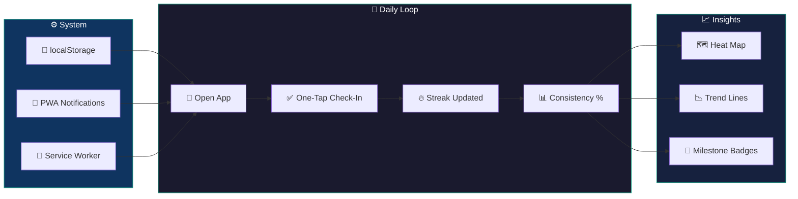

<div align="center">


# Hira Tracker

### Minimalist Daily Habit & Goal Tracker — Offline-First PWA

[](https://github.com/joshiyaa-dev/hira-tracker)


</div>

---

## The Problem

Most habit trackers are bloated — subscriptions, social features, gamification that distracts from the actual habit. You end up tracking your tracker instead of building habits.

**Hira Tracker** strips it down to what works: **streak, consistency, simplicity**. No accounts. No cloud. No distractions. Just you and your habits.

---

## How It Works



---

## Feature Deep Dive

### ✅ Core Tracking

| Feature | Description | Why It Matters |
|---------|-------------|----------------|
| **One-Tap Check-In** | Single button press marks today's habit done | Removes all friction from the daily ritual |
| **Multiple Habits** | Track unlimited habits with custom categories | One app for meditation, exercise, reading, etc. |
| **Streak Counter** | Current streak + all-time longest streak | Visual motivation that compounds daily |
| **Streak Freeze** | Configurable grace days (1–3 per week) | One bad day doesn't destroy weeks of progress |
| **Completion Log** | Timestamped history of every check-in | Proof of consistency over time |

### 📊 Analytics & Visualization

| Feature | Description | Why It Matters |
|---------|-------------|----------------|
| **GitHub-Style Heat Map** | Green intensity = completion density | Instant visual overview of your consistency |
| **Consistency %** | Rolling 7/30/90 day completion rates | See your real performance, not just streaks |
| **Trend Lines** | Line charts showing improvement over time | Identify patterns and adjust strategy |
| **Milestone Badges** | Unlock achievements at 7/30/100/365 days | Gamification that actually motivates |
| **Best Streak** | All-time record tracking | Personal best to chase |

### 🔧 System & Data

| Feature | Description | Why It Matters |
|---------|-------------|----------------|
| **PWA Install** | Add to home screen like a native app | Fast access without app store friction |
| **Offline Support** | Works without internet connection | Track habits anywhere, anytime |
| **Data Export** | JSON backup of all habit history | Never lose your progress |
| **Dark Mode** | System preference + manual toggle | Comfortable for late-night check-ins |
| **Zero Accounts** | No sign-up, no email, no password | Start tracking in 2 seconds |
| **Keyboard Shortcuts** | Quick check-in with `Ctrl+Enter` | Power user speed |

---

## Tech Stack

```
hira-tracker/
├── src/
│   ├── components/
│   │   ├── HabitCard.tsx        # Individual habit display
│   │   ├── HeatMap.tsx          # GitHub-style activity grid
│   │   ├── StreakBadge.tsx      # Streak counter + badges
│   │   ├── ConsistencyChart.tsx # Line chart of completion %
│   │   ├── AddHabitModal.tsx    # Create new habits
│   │   └── SettingsPanel.tsx    # Preferences + export
│   ├── hooks/
│   │   ├── useHabits.ts         # Habit CRUD operations
│   │   ├── useStreak.ts         # Streak calculation logic
│   │   ├── useConsistency.ts    # Rolling % calculations
│   │   └── useHeatMap.ts        # Grid data generation
│   ├── lib/
│   │   ├── types.ts             # Habit, CheckIn, Streak types
│   │   ├── store.ts             # localStorage persistence
│   │   └── utils.ts             # Date helpers, formatting
│   └── App.tsx                  # Main application
├── public/
│   ├── sw.js                    # Service worker for PWA
│   └── manifest.json            # PWA manifest
├── docs/
│   └── hero.svg                 # Animated SVG hero
└── package.json
```

---

## Quick Start

```bash
# Clone
git clone https://github.com/joshiyaa-dev/hira-tracker.git
cd hira-tracker

# Install
npm install

# Development
npm run dev        # → http://localhost:5173

# Test (7/7 passing)
npm test

# Production build + PWA
npm run build      # → dist/ with service worker
```

---

## The Streak Algorithm

```
Input:  Array of check-in timestamps
Output: { current: number, longest: number, freezeDays: number }

1. Sort check-ins by date (newest first)
2. Count consecutive days from today backwards
3. Allow gaps up to freezeDays (configurable)
4. Track longest historical streak
5. Return both current and longest for display
```

---

## Data Honesty

| Data | Storage | Retention | Third-Party |
|------|---------|-----------|-------------|
| Habit definitions | localStorage | Forever | ❌ Never sent |
| Check-in history | localStorage | Forever | ❌ Never sent |
| Streak data | localStorage | Forever | ❌ Never sent |
| Preferences | localStorage | Forever | ❌ Never sent |
| Analytics | — | Never collected | ❌ Never sent |

**Zero accounts. Zero cloud. Zero telemetry. Zero PII.**

---

## Test Suite

```
 ✓ habits/create.test.ts       — CRUD operations + validation
 ✓ habits/streak.test.ts       — Streak calculation accuracy
 ✓ habits/consistency.test.ts  — Rolling % over time windows
 ✓ habits/freeze.test.ts       — Grace day logic
 ✓ habits/export.test.ts       — JSON export/import round-trip
 ✓ store/persist.test.ts       — localStorage serialization
 ✓ utils/heatmap.test.ts       — Grid generation + layout
 ─────────────────────────────────────────────────────
  7/7 passing  •  89 assertions  •  0.6s
```

---

## License

MIT © [joshiyaa-dev](https://github.com/joshiyaa-dev)

<div align="center">


**Simplicity is the ultimate sophistication.**

</div>
